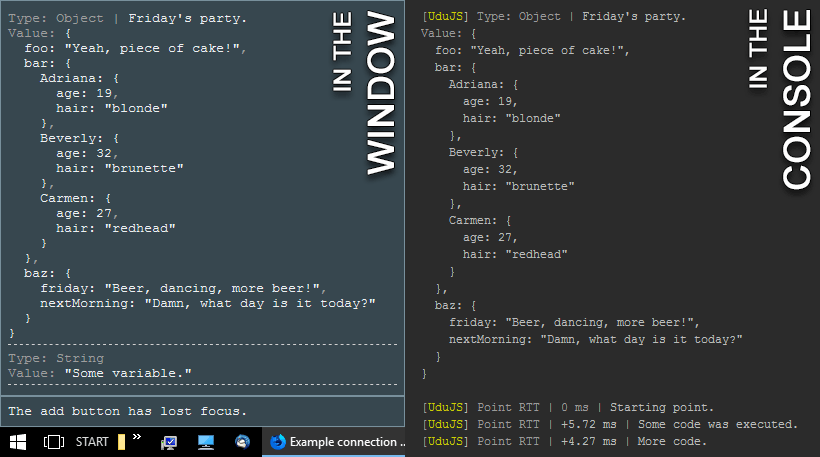
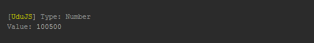
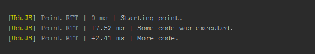
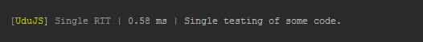
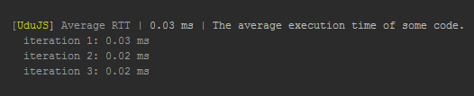
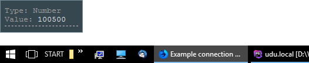
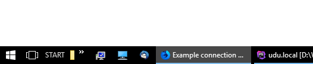
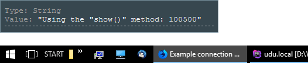
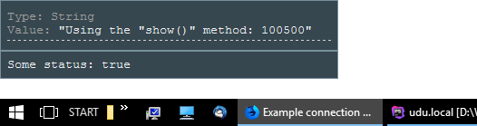

# UduJS

[](https://travis-ci.org/Heliax44/udujs)
[](https://coveralls.io/github/Heliax44/udujs?branch=master)
[](https://david-dm.org/Heliax44/udujs)
[](https://david-dm.org/Heliax44/udujs?type=dev)

**[Русская версия здесь.]**

A simple universal debugging utility for JavaScript code. Designed for Node.js and browsers.

**Make debugging more understandable and simple.**



## Support

Tested in:
* Node.js 6-8.
* Google Chrome 62-63.
* Firefox Developer Edition 57-58.

Do you have suggestions, wishes or comments? Welcome to [issue tracker]!

## Installation

```bash
$ npm i udujs
```

or

```bash
$ yarn add udujs
```

## Usage

* [Inclusion in the project](#Inclusion)
* [Customizing](#Customizing)
* [General methods](#GeneralMethods)
* [Client methods](#ClientMethods)
* [Support](#Support)

<a name="Inclusion"></a>
### Inclusion in the project

#### Server code:

* standard way (_automatic definition of the working environment_);
```js
const UduJS = require('udujs');
const Debug = new UduJS();
```
* direct connection of server methods.
```js
const UduJS = require('udujs/Server');
const Debug = new UduJS();
```
**Note**: both these methods of inclusion are almost identical. You can apply any of them.

#### Code on the client:

* standard way (not recommended);
```js
const UduJS = require('udujs');
const Debug = new UduJS();
```
* direct connection of client methods;
```js
const UduJS = require('udujs/Client');
const Debug = new UduJS();
```
* connect the compiled library directly to the HTML file (_folder <code>[compiled]</code>_).
```html
<script src="js/mod/udujs-1.0.0.min.js"></script> <!-- For example -->
<script>
  var Debug = new UduJS();
</script>
```
**Note**: the standard method of inclusion can lead to swelling of files when compiling a bundle.

<a name="Customizing"></a>
### Customizing

When creating an instance of the utility, you can specify an object with [custom settings]. This will help you adjust the debugging process a little. For example:
```javascript
const UduJS = require('udujs/Client');
const Debug = new UduJS({
  maxWidth: 'auto',
  fontSize: '1.2em',
  decimalPlaces: 4,
  popupColorScheme: 'dark',
});
```

<a name="GeneralMethods"></a>
### General methods

* [.log()](#log)
* [.rttPoint()](#rttPoint)
* [.rttStart()](#rttStart)
* [.rttFinish()](#rttFinish)
* [.rttAverage()](#rttAverage)
* [.stopExec()](#stopExec)
* [.resumeExec()](#resumeExec)

<a name="log"></a>
#### .log(value, [comment]) [API](./docs/en/general-api.md#log)

Outputs debugging information to the console.
This method returns nothing.
```javascript
const someVariable = +100500;
Debug.log(someVariable);
```

Result ([example code with common methods]):



<a name="rttPoint"></a>
#### .rttPoint([name]) ⇒ <code>number</code> [API](./docs/en/general-api.md#rttPoint)

Run-time testing (RTT).
Sets the control point in the code.
Calculates the code execution time between two control points (_in milliseconds_).
* Displays the calculated value in the console.
* Returns the calculated value.
```javascript
Debug.rttPoint();
someCode();
Debug.rttPoint('Some code was executed.');
someCode();
// Or, the result of the method can be assigned to a variable.
let lastPointResult = Debug.rttPoint('More code.');
```

Result ([example code with common methods]):



<a name="rttStart"></a>
#### .rttStart([name], [levelIndex]) [API](./docs/en/general-api.md#rttStart)

Run-time testing (RTT).
The starting point for computing the execution time of some code.
This method returns nothing.

<a name="rttFinish"></a>
#### .rttFinish([levelIndex]) ⇒ <code>number</code> [API](./docs/en/general-api.md#rttFinish)

Run-time testing (RTT).
The end point for the <code>rttStart()</code> method.
Calculates the execution time of the code between the start and current points (_in milliseconds_).
* Displays the calculated value in the console.
* Returns the calculated value.
```javascript
Debug.rttStart('Single testing of some code.');
someCode();
Debug.rttFinish();
// Or, the result of the method can be assigned to a variable.
let rttResult = Debug.rttFinish();
```

Result ([example code with common methods]):



<a name="rttAverage"></a>
#### .rttAverage(codeContainer, cycles, [name], [timeEachIteration]) ⇒ <code>number</code> [API](./docs/en/general-api.md#rttAverage)

Run-time testing (RTT).
Calculates the average execution time of some code (_in milliseconds_).
* Displays the calculated value in the console.
* Returns the calculated value.
```javascript
Debug.rttAverage(someCode, 3, 'The average execution time of some code.', true);
// Or, the result of the method can be assigned to a variable.
let averageResult = Debug.rttAverage(someCode, 3, 'The average execution time of some code.', true);
```

Result ([example code with common methods]):



<a name="stopExec"></a>
#### .stopExec() [API](./docs/en/general-api.md#stopExec)

The method stops execution of the utility.
This method returns nothing.

<a name="resumeExec"></a>
#### .resumeExec() [API](./docs/en/general-api.md#resumeExec)

The method resumes execution of the utility.
This method returns nothing.
```javascript
Debug.stopExec();
// The application code between these methods will be executed.
someCode(); // This code will be executed.
// Utility methods, on the contrary, will be ignored.
Debug.log('This method will be ignored.');
Debug.resumeExec();
```

<a name="ClientMethods"></a>
### Client methods

* [.popup()](#popup)
* [.popupReset()](#popupReset)
* [.show()](#show)
* [.observer()](#observer)

<a name="popup"></a>
#### .popup() [API](./docs/en/client-api.md#popup)

Displays debugging information in the list in a pop-up message in the browser window.
This method returns nothing.
```javascript
const someVariable = +100500;
Debug.popup(someVariable);
```

Result ([example code with client methods]):



<a name="popupReset"></a>
#### .popupReset() [API](./docs/en/client-api.md#popupReset)

Clears the list in a pop-up message.
This method returns nothing.
```javascript
Debug.popupReset();
```

Result ([example code with client methods]):



<a name="show"></a>
#### .show() [API](./docs/en/client-api.md#show)

A universal method for displaying debugging information.
Outputs either to the console or to a pop-up message.
The output direction is controlled via the configuration (_parameter <code>[showOutputDirection]</code>_).
By default, the information is displayed in a pop-up message.
This method returns nothing.
```javascript
const someVariable = +100500;
Debug.show(`Using the "show()" method: ${someVariable}`);
```

Result ([example code with client methods]):



<a name="observer"></a>
#### .observer() [API](./docs/en/client-api.md#observer)

Displays debug information in a fixed field in a pop-up message.
This method returns nothing.

```javascript
const someStatus = true;
Debug.observer(`Some status: ${someStatus}`);
```

Result ([example code with client methods]):



[Русская версия здесь.]:./docs/ru/index.md "Документация на русском языке"
[compiled]:/compiled
[custom settings]:./docs/en/custom-settings.md
[example code with common methods]:./app/server-app.js
[example code with client methods]:./app/client-app.js
[showOutputDirection]:./docs/en/custom-settings.md#showOutputDirection
[issue tracker]:https://github.com/Heliax44/udujs/issues
